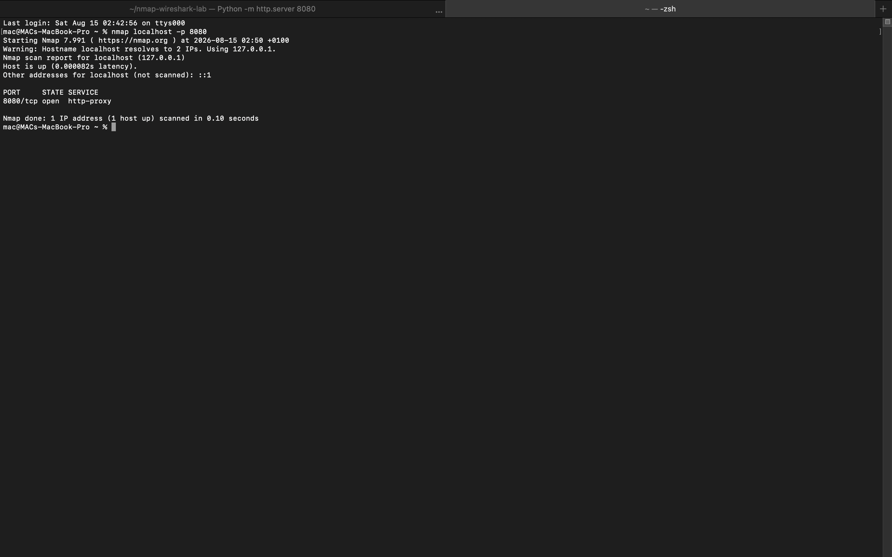
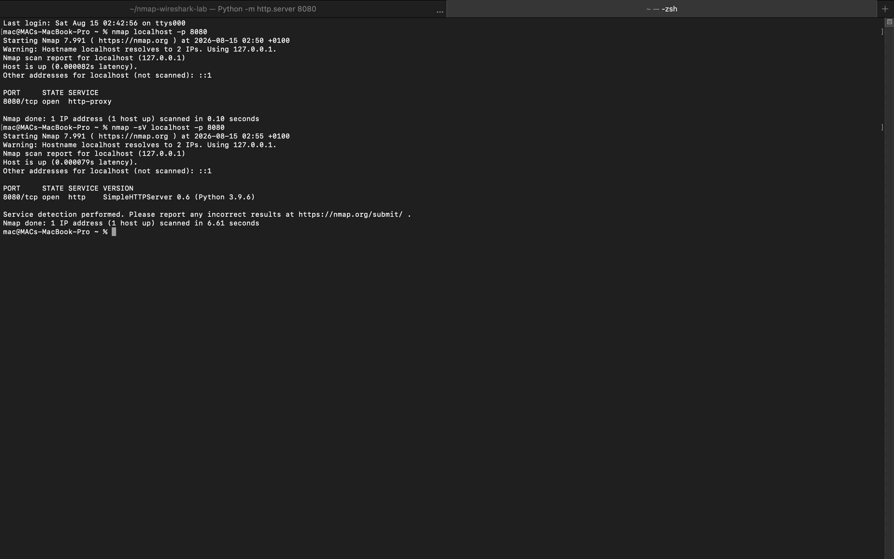
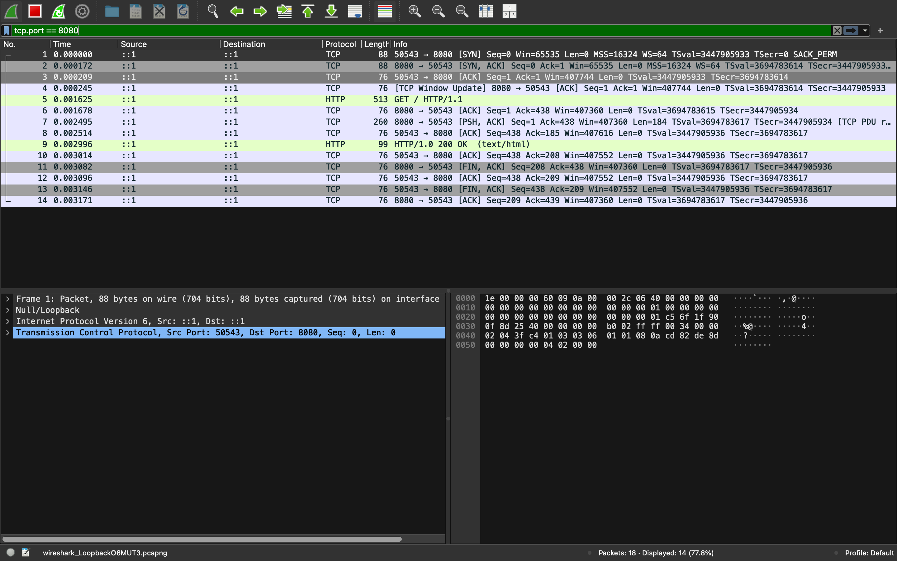
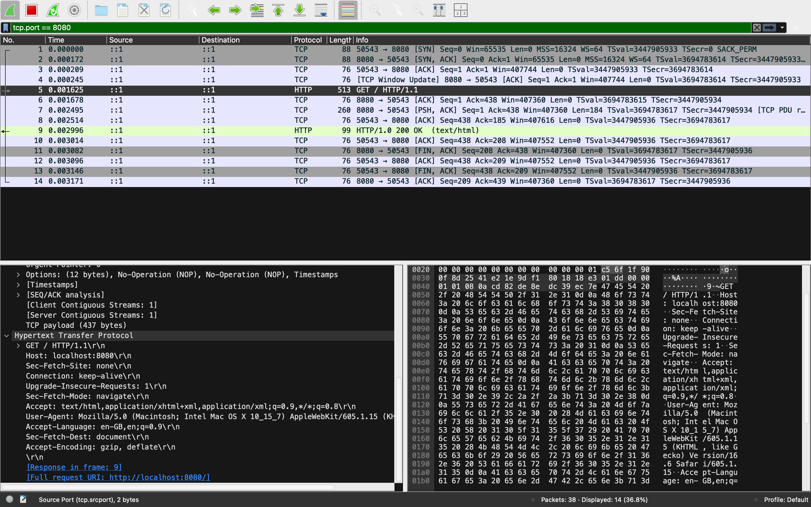
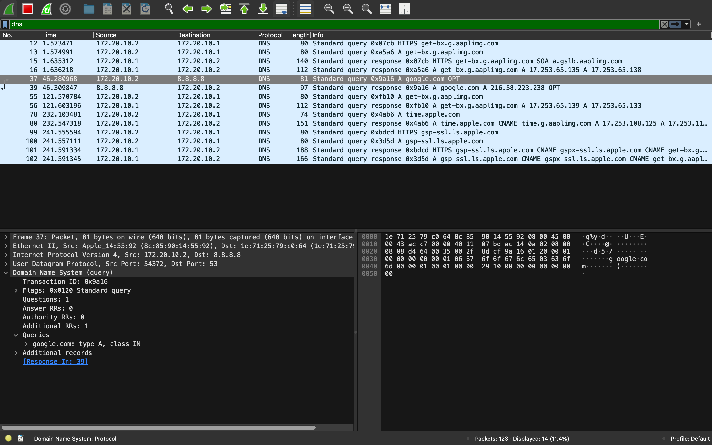
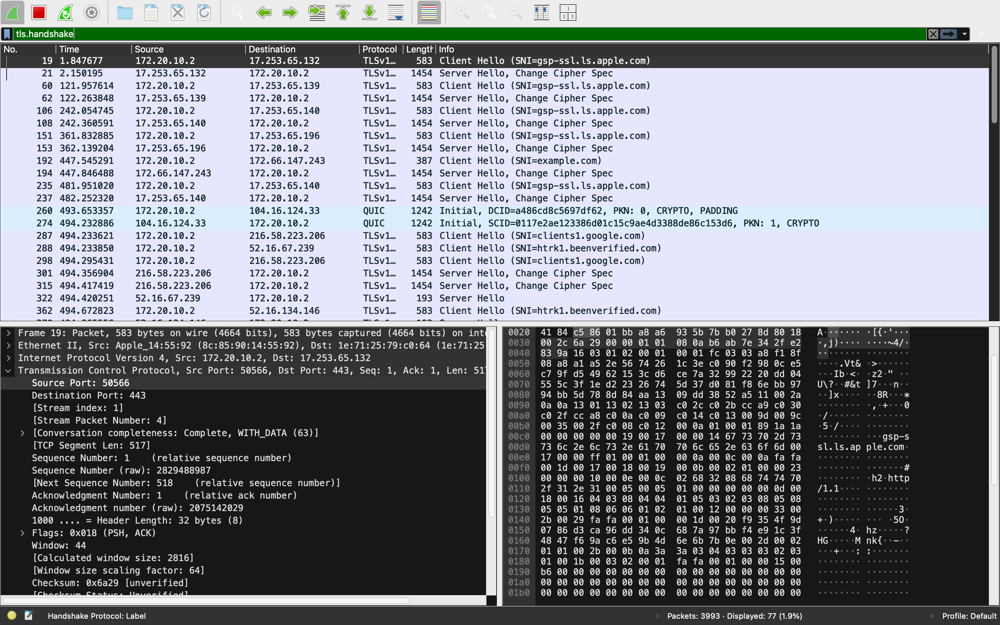
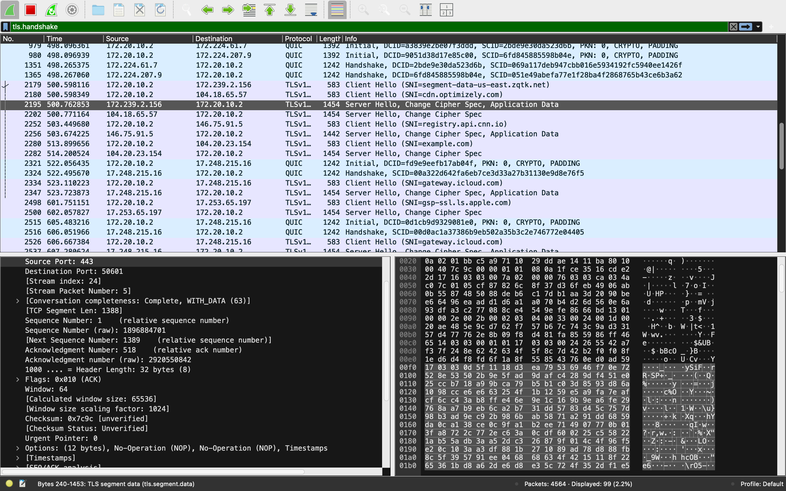

# Project 2: Network Discovery & Traffic Analysis

## Overview

As part of my cybersecurity learning journey, I conducted a practical network investigation using **Nmap** and **Wireshark**.

The purpose of this project was to understand how cybersecurity professionals can discover network services and analyze the traffic generated by network communication.

I used Nmap for network discovery and port/service identification, while Wireshark was used to capture and analyze network packets.

This project helped me connect networking theory with practical cybersecurity investigation.

---

## Objectives

The objectives of this project were to:

- Understand basic network reconnaissance.
- Use Nmap to identify open ports and services.
- Understand TCP ports and network services.
- Capture network traffic using Wireshark.
- Analyze DNS traffic.
- Observe the TCP three-way handshake.
- Examine HTTP traffic.
- Examine HTTPS/TLS traffic.
- Understand the difference between HTTP and HTTPS.
- Compare active reconnaissance with passive traffic analysis.

---

## Tools Used

| Tool | Purpose |
|---|---|
| Nmap | Network discovery and port/service identification |
| Wireshark | Packet capture and network traffic analysis |
| Terminal | Running network commands |
| Safari | Generating web traffic |
| `nslookup` / `dig` | DNS investigation |
| VS Code | Project documentation |
| GitHub | Portfolio |

---

# Part 1 Network Discovery with Nmap

## 1.1 What is Nmap?

**Nmap (Network Mapper)** is a network discovery and security auditing tool.

It can be used to identify:

- Hosts
- Open ports
- Services
- Service versions
- Network configurations

For this project, I used Nmap only against systems I was authorized to investigate.

---

## 1.2 Scanning My Local Machine

I first scanned my own Mac using:

```bash
nmap localhost
```

`localhost` refers to my own computer.

The purpose was to see whether Nmap could identify services listening on my machine.

---

## 1.3 Creating a Controlled Test Service

To create a safe environment for testing, I started a simple HTTP server on my own Mac.

I created a test directory and webpage:

```bash
mkdir ~/nmap-wireshark-lab
cd ~/nmap-wireshark-lab
echo "Wireshark and Nmap Lab" > index.html
```

I then started a Python HTTP server:

```bash
python3 -m http.server 8080
```

This created a local HTTP service accessible at:

```text
http://localhost:8080
```

---

## 1.4 Discovering the Open Port

I used Nmap to scan port 8080:

```bash
nmap localhost -p 8080
```

The scan identified port `8080` as open.

### Evidence



### Observation

Nmap was able to identify that a service was accepting connections on TCP port 8080.

An open port does not automatically mean that a system is vulnerable. It indicates that a service is listening and may warrant further investigation.

---

## 1.5 Service Detection

I then used Nmap's service detection feature:

```bash
nmap -sV localhost -p 8080
```

The `-sV` option attempts to identify the service and version associated with an open port.

### Evidence



### What I Learnt

Port numbers provide useful clues about network services, but the port number alone does not guarantee which service is running.

Service detection provides additional information that can help an analyst understand what is exposed on a system.

---

# Part 2 Network Traffic Analysis with Wireshark

## 2.1 Capturing Network Traffic

I used Wireshark to capture network traffic generated by my Mac.

For the local HTTP experiment, I captured traffic on the macOS loopback interface:

```text
lo0
```

This allowed me to observe communication between my browser and the local HTTP server.

---

# 2.2 TCP Three-Way Handshake

When I accessed:

```text
http://localhost:8080
```

TCP established a connection before HTTP data was exchanged.

The TCP three-way handshake consists of:

```text
Client → SYN
Server → SYN-ACK
Client → ACK
```

### Evidence



### What I Observed

The three packets demonstrated the establishment of a TCP connection between the client and server.

1. **SYN** — The client requested a connection.
2. **SYN-ACK** — The server acknowledged the request.
3. **ACK** — The client acknowledged the server.

The TCP connection was then ready for data transfer.

---

# 2.3 HTTP Request

After the TCP connection was established, the browser sent an HTTP request to the local server.

A request can appear similar to:

```http
GET / HTTP/1.1
Host: localhost:8080
```

### Evidence



### What I Learnt

Because this was an unencrypted HTTP connection, the HTTP request and other application-layer information could be observed directly in the packet capture.

This demonstrated an important difference between HTTP and HTTPS.

HTTPS uses TLS to encrypt application data in transit, making the contents much harder to observe through a normal packet capture.

---
# Part 3 DNS Analysis

## 3.1 DNS Resolution

I investigated DNS traffic generated when resolving a domain name.

For example:

```bash
dig google.com
```

I then used the Wireshark filter:

```text
dns
```

to isolate DNS packets.

### Evidence



### What I Learnt

DNS translates human-readable domain names into IP addresses that computers can use to establish network connections.

By inspecting DNS traffic in Wireshark, I could observe the DNS queries sent by my Mac and the responses containing the resolved IP addresses.

This demonstrated how DNS acts as an important first step when a device connects to a domain.

---
## 3.2 DNS Query and Responses

When I accessed 'google.com', my Mac generated DNS traffic to resolve the domain name.

The DNS Query asked for the IP address associated with 'google.com'.

The DNS response returned the corresponding IP address information.

### Evidence


### What I observed

The Wireshark capture showed DNS query and response packets between my Mac and DNS server.

The query contained the domain name being requested, while the response contained the resolved address information.

---

# Part 4 HTTPS and TLS Analysis

## 4.1 HTTPS Traffic

I then investigated encrypted web traffic.

HTTPS commonly uses TCP port:

```text
443
```

In Wireshark, I used:

```text
tcp.port == 443
```

to identify traffic associated with port 443.

---

## 4.2 TLS Handshake

I used the following Wireshark filter:

```text
tls.handshake
```

to identify TLS handshake traffic.

I observed packets such as:

```text
Client Hello
Server Hello
Application Data
```

### Evidence



### What I Learnt

The TLS handshake allows the client and server to establish the parameters needed for secure communication.

---

# 4.3 Encrypted Application Data

After the TLS handshake, Wireshark displayed traffic such as:

```text
Application Data
```

### Evidence



Unlike the HTTP experiment, I could not simply read the webpage's application data as plaintext.

This demonstrated how TLS protects application data during HTTPS communication.

---

# Part 5 HTTP vs HTTPS

The two experiments demonstrated an important security difference.

### HTTP

```text
Browser
   ↓
TCP
   ↓
HTTP
   ↓
Readable application data
```

### HTTPS

```text
Browser
   ↓
TCP
   ↓
TLS handshake
   ↓
Encrypted application data
```

With HTTP, application-layer information can be visible in a packet capture because the traffic is not encrypted.

With HTTPS, the application data is encrypted using TLS so the contents are not normally readable. from the packet capture alone.

---

# Part 6 Nmap vs Wireshark

This project helped me understand that Nmap and Wireshark serve different purposes.

| Nmap | Wireshark |
|---|---|
| Active reconnaissance | Passive traffic analysis |
| Discovers ports | Captures packets |
| Identifies services | Analyzes protocols |
| Scans hosts | Observes communication |
| Answers "What's exposed?" | Answers "What's happening?" |

**For example, Nmap identified:**

```text
8080/tcp open
```

Wireshark then allowed me to observe the actual communication occurring through that connection.

## What I learnt

Nmap tells me what services and ports are available. Wireshark lets me inspect the network traffic itself.

---

# Part 7 Key Findings

The investigation demonstrated the following process:

```text
DNS Resolution
      ↓
IP Address
      ↓
TCP Connection
      ↓
TLS Handshake
      ↓
Encrypted Application Data
```

I also learned that different cybersecurity tools can provide different perspectives of the same network environment.

Nmap helped me identify exposed services and ports, while Wireshark helped me understand the traffic associated with network communication.

---

# Part 8 Security Lessons

One of my main takeaways was that **encryption does not make network traffic completely invisible**.

Even when HTTPS is used, an analyst may still observe metadata such as:

- Source IP address
- Destination IP address
- Port numbers
- Packet size
- Timing information
- Protocol information
- TLS-related information

However, the actual application content is protected by encryption.

This demonstrated why HTTPS is important for protecting sensitive information during network communication.

---

# Part 9 Ethical Considerations

All scanning and packet analysis in this project was performed for educational purposes on systems and network traffic I was authorized to investigate.

Nmap should not be used to scan systems without permission.

Network traffic should only be captured and analyzed when appropriate authorization exists.

Responsible cybersecurity practice requires respecting authorization, privacy and applicable laws.

---

# What I Learnt

Through this project, I gained practical experience with:

- Nmap
- Wireshark
- Network reconnaissance
- Port scanning
- Service detection
- DNS
- TCP/IP
- TCP three-way handshake
- HTTP
- HTTPS
- TLS
- Packet analysis
- Network traffic filtering
- Encrypted communication

Most importantly, I learned how to move from **learning networking concepts theoretically to observing them in real network traffic**.

---

# Challenges

Initially, the large number of packets displayed by Wireshark made analysis difficult.

Using display filters helped me isolate specific traffic.

For example:

```text
dns
```

was used for DNS traffic.

```text
tcp.port == 443
```

was used to investigate HTTPS-related traffic.

```text
tls.handshake
```

was used to investigate TLS negotiation.

This taught me the importance of filtering traffic when conducting network analysis.

---

# Conclusion

This project allowed me to combine **Nmap and Wireshark** to investigate network communication from two different perspectives.

Nmap helped me understand **network discovery, ports and services**, while Wireshark allowed me to observe the actual packets involved in network communication.

This practical exercise helped me understand not only **how networks work**, but also how cybersecurity professionals can investigate them.
